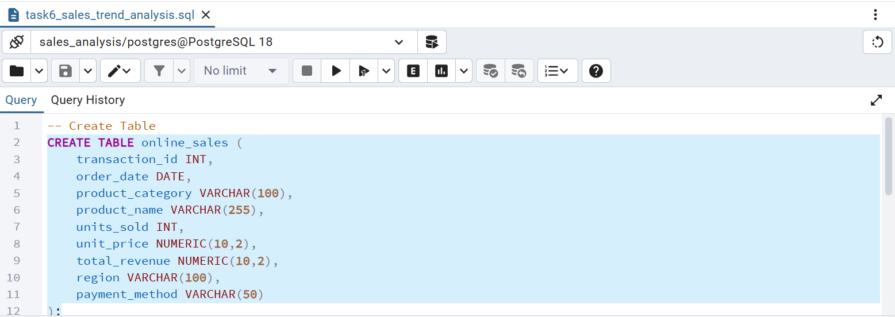
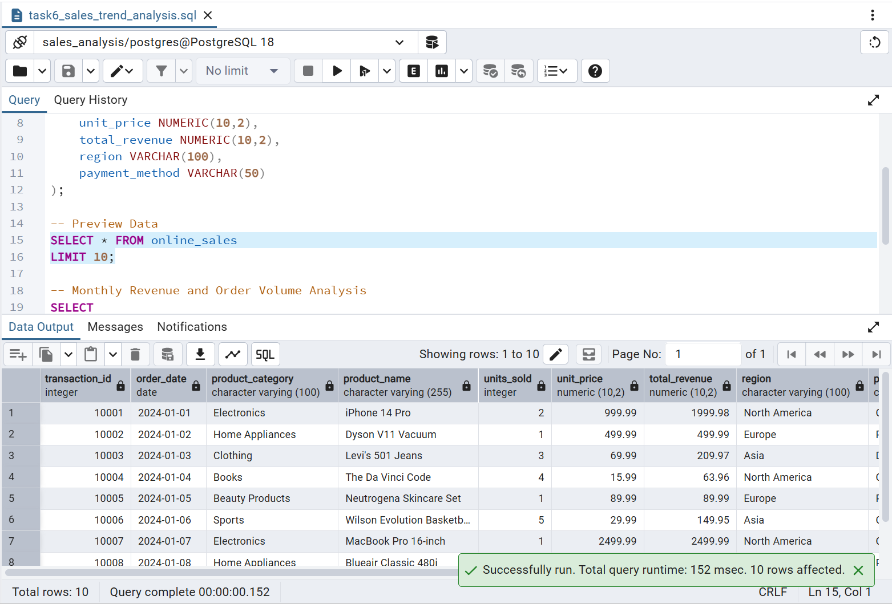
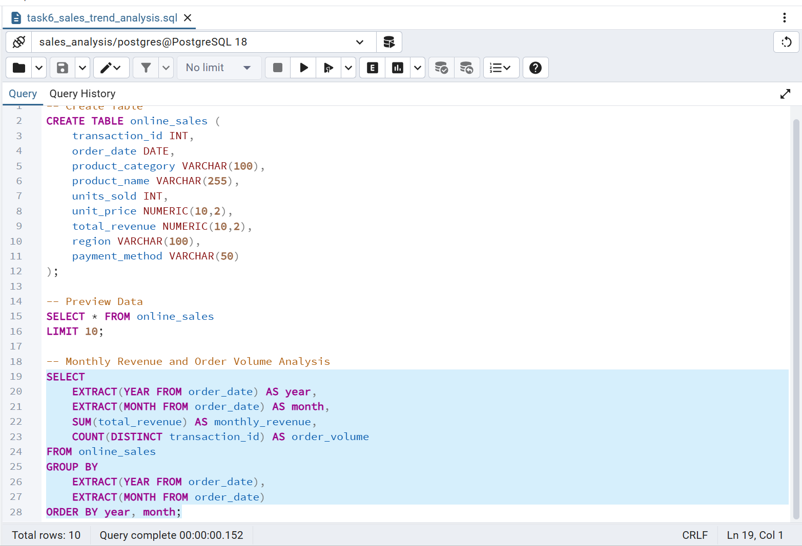
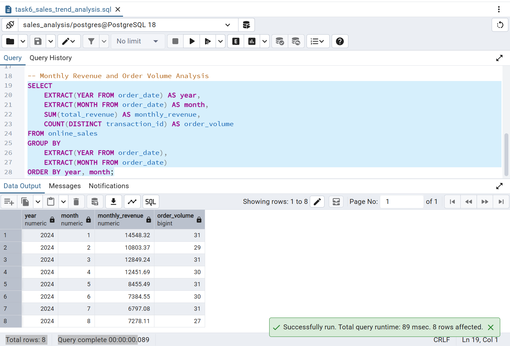

# 📊 DataXLabs Task 6 - Sales Trend Analysis Using Aggregations

## 📌 Objective

Analyze monthly revenue and order volume using SQL aggregation functions to identify sales trends over time.

---

## 🛠️ Tools Used

- PostgreSQL
- SQL
- pgAdmin 4

---

## 📂 Dataset

**Online Sales Data Dataset**

### Columns Used

- Transaction ID
- Order Date
- Product Category
- Product Name
- Units Sold
- Unit Price
- Total Revenue
- Region
- Payment Method

---

## 🗄️ Table Creation

```sql
CREATE TABLE online_sales (
    transaction_id INT,
    order_date DATE,
    product_category VARCHAR(100),
    product_name VARCHAR(255),
    units_sold INT,
    unit_price NUMERIC(10,2),
    total_revenue NUMERIC(10,2),
    region VARCHAR(100),
    payment_method VARCHAR(50)
);
```

### Screenshot



---

## 🔍 Data Preview

```sql
SELECT *
FROM online_sales
LIMIT 10;
```

### Screenshot



---

## 📊 Monthly Sales Trend Analysis Query

```sql
SELECT
    EXTRACT(YEAR FROM order_date) AS year,
    EXTRACT(MONTH FROM order_date) AS month,
    SUM(total_revenue) AS monthly_revenue,
    COUNT(DISTINCT transaction_id) AS order_volume
FROM online_sales
GROUP BY
    EXTRACT(YEAR FROM order_date),
    EXTRACT(MONTH FROM order_date)
ORDER BY year, month;
```

### Screenshot



---

## 📈 Query Output

The query calculates:

- Monthly Revenue
- Monthly Order Volume
- Sales Trends Over Time

### Screenshot



---

## 📚 SQL Concepts Used

- Aggregate Functions
- SUM()
- COUNT()
- EXTRACT()
- GROUP BY
- ORDER BY
- Data Analysis

---

## 🎯 Key Insights

- Calculated monthly revenue using SQL aggregation.
- Measured order volume for each month.
- Grouped sales data by year and month.
- Identified monthly sales trends.
- Generated meaningful business insights from transactional data.

---

## 📁 Repository Contents

```text
DataXLabs_Task6_Sales_Trend_Analysis
│
├── Online Sales Data.csv
├── task6_sales_trend_analysis.sql
├── Table_Creation.png
├── Data_Preview.png
├── Monthly_Sales_Query.png
├── Query_Output.png
└── README.md
```

---

## ✅ Outcome

Successfully completed **Task 6 – Sales Trend Analysis Using Aggregations** as part of the **DataXLabs Data Analyst Internship**.

The project demonstrates how SQL aggregation functions can be used to analyze monthly sales performance, calculate revenue, measure order volume, and identify trends in business data.

---

## 👩‍💻 Author

**Kapa Sri Lakshmi**  
B.Tech – Computer Science and Engineering  
Mohan Babu University  
Aspiring Data Analyst

### Connect With Me

- GitHub: https://github.com/kapasrilakshmi075
- LinkedIn: Add your LinkedIn profile link here
